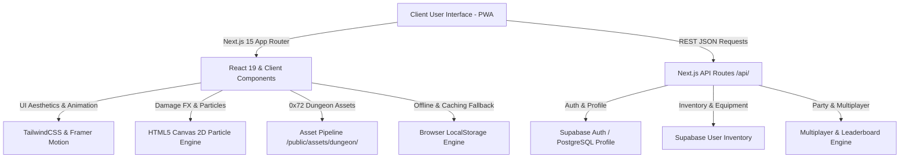

# ⚔️ IRONPIXELS — Gamified Fitness PWA & Retro RPG Dungeon Crawler

> **"Level up your gains, literally."**  
> *IronPixels adalah Progressive Web Application (PWA) berbasis gamifikasi fitness yang mengonversi keringat, angkatan beban, dan konsistensi latihan fisik pengguna menjadi progres karakter RPG retro 16-bit secara real-time.*

---

## 📋 Daftar Isi
1. [Ringkasan Eksekutif & Value Proposition](#-ringkasan-eksekutif--value-proposition)
2. [Arsitektur Sistem & Spesifikasi Teknologi](#-arsitektur-sistem--spesifikasi-teknologi)
3. [Algoritma Game Engine (RVS Engine)](#-algoritma-game-engine-rvs-engine)
4. [Penjabaran Fitur Utama (Feature Breakdown)](#-penjabaran-fitur-utama-feature-breakdown)
5. [Spesifikasi Skema Data & Relasi Database](#-spesifikasi-skema-data--relasi-database)
6. [Arsitektur REST API Endpoints](#-arsitektur-rest-api-endpoints)
7. [Panduan Instalasi & Pengembangan Lokal](#-panduan-instalasi--pengembangan-lokal)

---

## 🛡️ Ringkasan Eksekutif & Value Proposition

Aplikasi *fitness tracker* konvensional seringkali gagal mempertahankan retensi pengguna jangka panjang karena sifatnya yang monoton. **IronPixels** merevolusi rutinitas *gym* dengan menggabungkan pelacakan latihan beban (*weightlifting*) dengan mekanik pertempuran MMORPG/RPG retro.

* **Gamifikasi Latihan Bebas Bias**: Setiap repetisi dan volume angkatan dihitung menggunakan algoritma **Relative Volume Score (RVS)** yang adil, mempertimbangkan proporsi berat badan dan jenis latihan fisik pengguna.
* **Pixel Art Retrogaming Real-Time**: Visualisasi pertarungan menggunakan asset pixel resmi dari **0x72 Dungeon Tileset II v1.7**, lengkap dengan *frame animation* karakter (pria/wanita), 27 jenis senjata dungeon, peti *gacha*, dan bos monster.
* **Fitur Sosial & Guild Party**: Pemain dapat membentuk *Guild Party* hingga **10 anggota**, mengundang teman latihan, dan berkompetisi di **6 papan peringkat terpisah**.

---

## 🏗️ Arsitektur Sistem & Spesifikasi Teknologi

IronPixels dibangun menggunakan arsitektur web modern yang mengutamakan performa *load time* cepat, daya tanggap tinggi, dan animasi render yang mulus tanpa bergantung pada *game engine* eksternal yang berat.



### Stack Teknologi Utamanya:
* **Framework Utamanya**: `Next.js 15.5` (App Router, Server Actions, Client Components).
* **UI & Design System**: `TailwindCSS 3.4`, Vanilla CSS, Lucide Icons, Modern Dark Cyberpunk / Pixel-Art Glassmorphism.
* **Animasi & Render Visual**: `Framer Motion 12`, HTML5 Canvas 2D Engine (FX Angka Damage Floating & Hit Particles).
* **Database & Auth Integration**: `Supabase Database (PostgreSQL)` & `Supabase SSR Client`.
* **Visual Asset Standard**: **0x72 Dungeon Tileset II v1.7** (Framed Sliced Sprites, Dynamic Stage Map, Gendered Heroes, Dungeon Weapons, Mimic Chests, Monsters).

---

## 🧮 Algoritma Game Engine (RVS Engine)

Untuk mencegah kecurangan (*anti-cheat*) dan memastikan keadilan antara pemain dengan berat badan berbeda, *damage* serangan ke Bos tidak dihitung dari beban absolut mentah, melainkan melalui formulasi **Relative Volume Score (RVS)**:

$$\text{RVS} = \left( \frac{\text{Beban Latihan (kg)}}{\text{Berat Badan Hero (kg)}} \right) \times \text{Repetisi} \times \text{Movement Coefficient}$$

### Matriks Koefisien Gerakan Latihan (Movement Coefficient):
| Tier Gerakan | Klasifikasi | Contoh Gerakan Gym | Koefisien Multiplier |
| :--- | :--- | :--- | :--- |
| **Tier A** | *Isolation & Small Muscles* | Bicep Curls, Lateral Raises, Tricep Extensions | `2.0 - 3.0` |
| **Tier B** | *Free-Weight Compound* | Barbell Squats, Bench Press, Deadlifts | `1.0 - 1.5` |
| **Tier C** | *Machine & Supported* | Leg Press, Smith Machine Squats, Cable Row | `0.5 - 0.8` |

### Formulasi Total Combat Power (CP):
$$\text{Total CP} = (\text{Level} \times 100) + (\text{STR} \times 3.5) + (\text{AGI} \times 2.5) + (\text{VIT} \times 2.5) + (\text{LUK} \times 2.0) + (\text{Active Gear} \times 150) + \text{Daily RVS}$$

---

## 🕹️ Penjabaran Fitur Utama (Feature Breakdown)

### 1. The Hub (Dashboard Utama Hero)
* **Status Profile & Avatar Header**: Displays Hero Level, EXP, Gold, Weight (kg), and dynamic **PixelAvatar** rendering 0x72 character sprites.
* **Class & Perk System**:
  * 🛡️ **Cyber Knight / Warrior**: `+15% RVS STR Damage Bonus`.
  * 🗡️ **Shadow Ninja / Rogue**: `+20% Critical Hit Chance (AGI)`.
  * 🏰 **Iron Vanguard / Paladin**: `+250 MAX HP & Defensive Shield`.
  * ⚡ **Titan Berserker**: `+20% Extra Gold & EXP Loot`.
* **Stat Radar Chart & Attribute Upgrade**: Alokasi **Ability Points (AP)** untuk meningkatkan **STR**, **AGI**, **VIT**, dan **LUK**.
* **Critical HP Exhaustion Alert**: Jika HP Hero di bawah 20%, aplikasi menampilkan indikator bahaya merah berkedip. Hero dapat memulihkan HP dengan menyelesaikan sesi *gym* atau meminum Potion.
* **Daily Boss Penalty Check**: Jika pemain tidak mencatat sesi *workout* pada hari sebelumnya, **Demon Lord Ignis** akan menyerang Hero sebesar `-250 HP`.

### 2. Workout Tracker (Log Pertempuran Gym)
* Pencatatan sesi gym berbasis set, repetisi, dan beban (kg) dengan *Exercise Library* terstruktur.
* Tombol *Finish Session* menghitung akumulasi RVS, memulihkan HP Hero sebesar `1.5x RVS`, memberikan koin Gold dari total volume angkatan, dan memicu animasi kemenangan *Gym Raid Victory*.
* Fitur *Workout History List* untuk meninjau log riwayat latihan fisik historis.

### 3. Boss Arena & Semi-Active Battle System
* **DungeonStageMap (Map Terpotong Dinamis)**: Latar belakang dungeon berbahan tile terpotong 0x72 yang berganti dekorasi secara dinamis tiap Stage (Banner Hijau/Merah/Biru/Emas, Air Mancur Darah/Mana Animasi, Kotak Kayu, Tengkorak, Pilar Stone).
* **Progressive 20 Stage Bosses**: Bos monster bertingkat (*Goblin Berserker King*, *Orc Warlord Grok*, *Blood Beast*, *Demon Lord Ignis*, *Abyssal Void Dragon*, hingga *World Boss Ragnarok*).
* **Floating Particle Engine**: Animasi partikel Canvas 2D yang memunculkan angka *damage* dan efek *Critical Hit* melayang saat menyerang.
* **Tactical Gear Skill Bar**: Bilah 4 slot skill taktis dari perlengkapan Hero (1 Weapon Skill, 1 Armor Skill, Max 2 Accessory Skills) lengkap dengan *cooldown timer* tersimpan.
* **Testing Instant Kill Button**: Fitur khusus untuk pengujian teknis (*instant kill test*).

### 4. Blacksmith Forge & Chest Gacha Shop
* **Sistem Gacha 3 Peti 0x72 Unik**:
  * 📦 **Bronze Cache (500 Gold)**: Common & Rare Gear.
  * 🎁 **Silver Cache (2,500 Gold)**: Rare & Epic Gear.
  * 👾 **Void Relic Chest (10,000 Gold)**: Epic, Legendary & Mythic Relics (Sprite Mimic Monster).
* **Potion Shop**: 🧪 **Elixir of Full Recovery (10,000 Gold)** memulihkan HP Hero seketika menjadi 100% Full Max HP.
* **Interactive Unboxing Reel**: Animasi roda gacha *spinning reel* yang memperlihatkan barang sebelum mendarat di barang pemenang.

### 5. Equipment Vault & Inventaris
* **Strict 4-Slot Equipment Rules**: Membatasi penggunaan item terpasang menjadi tepat 4 slot (1 Weapon, 1 Armor, Maksimal 2 Accessories).
* **Stat Bonus & Skill Granting**: Setiap perlengkapan memberikan bonus stat acak dan *Skill Unique*.
* **27 Senjata Pixel 0x72**: *Rusty Iron Broadsword*, *Shadow Katana*, *Frostbite Spear*, *Sunfire Holy Excalibur*, *Quantum Singularity Cannon*, dll.

### 6. Multiplayer Realm & Guild Party
* **Sistem Pertemanan (Friends)**: Cari username pemain lain, kirim permintaan pertemanan (*Send Request*), serta terima/tolak undangan (*Accept/Reject*).
* **Guild Party System (Kapasitas 10 Member)**:
  * Pembuatan Guild Party kustom.
  * Undang hingga 10 anggota untuk menggabungkan Total Combat Power (CP).
  * Pemilik Guild Party (*Owner*) memiliki akses pengaturan kustom untuk mengubah nama party atau membubarkan party.
* **6 Leaderboard Terpisah**:
  1. Solo Warriors - Top Combat Power (CP)
  2. Solo Warriors - Top Daily RVS
  3. Solo Warriors - Top Workout Streak
  4. Guild Parties - Top Combined CP
  5. Guild Parties - Top Combined Daily RVS
  6. Guild Parties - Top Party Streak

---

## 🗄️ Spesifikasi Skema Data & Relasi Database

Aplikasi menggunakan skema database PostgreSQL Supabase dengan struktur tabel utama sebagai berikut:

```sql
-- 1. Tabel Profiles (User Hero Data)
CREATE TABLE profiles (
  id UUID PRIMARY KEY REFERENCES auth.users(id),
  username TEXT NOT NULL,
  character_class TEXT DEFAULT 'WARRIOR',
  gender TEXT DEFAULT 'm',
  level INT DEFAULT 1,
  current_hp INT DEFAULT 1000,
  max_hp INT DEFAULT 1000,
  exp INT DEFAULT 0,
  max_exp INT DEFAULT 1000,
  gold BIGINT DEFAULT 999999999,
  weight_kg NUMERIC(5,2) DEFAULT 75.0,
  available_ap INT DEFAULT 5,
  stats JSONB DEFAULT '{"str": 85, "agi": 72, "vit": 54, "luk": 60}'::jsonb,
  created_at TIMESTAMP WITH TIME ZONE DEFAULT NOW()
);

-- 2. Tabel User Inventory (Equipment Vault)
CREATE TABLE user_inventory (
  inventory_id UUID PRIMARY KEY DEFAULT gen_random_uuid(),
  user_id UUID REFERENCES profiles(id) ON DELETE CASCADE,
  item_id TEXT NOT NULL,
  is_equipped BOOLEAN DEFAULT FALSE,
  created_at TIMESTAMP WITH TIME ZONE DEFAULT NOW()
);

-- 3. Tabel Workout Sessions & Log Set
CREATE TABLE workout_sessions (
  session_id UUID PRIMARY KEY DEFAULT gen_random_uuid(),
  user_id UUID REFERENCES profiles(id) ON DELETE CASCADE,
  total_rvs NUMERIC(10,2) NOT NULL,
  total_volume_kg NUMERIC(10,2) NOT NULL,
  exercises_log JSONB NOT NULL,
  created_at TIMESTAMP WITH TIME ZONE DEFAULT NOW()
);

-- 4. Tabel Guild Party
CREATE TABLE party (
  party_id UUID PRIMARY KEY DEFAULT gen_random_uuid(),
  party_name TEXT NOT NULL,
  leader_id UUID REFERENCES profiles(id),
  members JSONB NOT NULL, -- Maksimal 10 Anggota
  total_party_cp INT DEFAULT 0
);
```

---

## 🌐 Arsitektur REST API Endpoints

| Method | Endpoint | Deskripsi Fungsi |
| :--- | :--- | :--- |
| `GET` | `/api/user/profile` | Mengambil data profil hero, HP, EXP, Gold, dan stats pemain. |
| `GET` | `/api/user/inventory` | Mengambil daftar inventaris perlengkapan pemain. |
| `POST` | `/api/inventory/equip` | Memasang atau melepas item perlengkapan (1 Wpn, 1 Arm, Max 2 Acc). |
| `POST` | `/api/workout/submit` | Mengirim data log sesi gym, menghitung RVS, memicu kenaikan level/exp & gold. |
| `GET` | `/api/combat/boss` | Mengambil status bos aktif saat ini (stage, HP, max HP, tipe bos). |
| `POST` | `/api/combat/attack` | Mengeksekusi serangan RVS ke Bos & mengembalikan sisa HP Bos serta status kekalahan. |
| `POST` | `/api/combat/execute-skill` | Mengeksekusi damage skill dari perlengkapan hero. |
| `POST` | `/api/shop/gacha` | Mengundi gacha chest (Bronze, Silver, Void Relic) & mengurangi saldo Gold. |
| `GET` | `/api/multiplayer/leaderboard` | Mengambil 6 kategori papan peringkat (Solo & Party untuk CP, RVS, Streak). |
| `GET` | `/api/multiplayer/friends` | Mengambil daftar teman, pencarian pemain, dan request pertemanan. |
| `POST` | `/api/multiplayer/friends` | Mengirim, menerima, atau menolak permintaan pertemanan. |
| `GET` | `/api/multiplayer/party` | Mengambil data Guild Party tempat pemain bergabung. |
| `POST` | `/api/multiplayer/party` | Membuat party baru, mengundang anggota (max 10), atau membubarkan party. |

---

## ⚙️ Panduan Instalasi & Pengembangan Lokal

### Prasyarat System:
* Node.js v18.0.0+ atau v20.0.0+
* NPM atau Yarn

### Langkah Setup & Running:

1. **Clone Repository**:
   ```bash
   git clone https://github.com/felixpalingan/IronPixels.git
   cd IronPixels
   ```

2. **Instalasi Dependency**:
   ```bash
   npm install
   ```

3. **Salin Asset Pipeline (0x72 Dungeon Assets)**:
   ```bash
   node scripts/copy_dungeon_assets.js
   ```

4. **Konfigurasi Environment (`.env.local`)**:
   ```env
   NEXT_PUBLIC_SUPABASE_URL=https://your-supabase-project.supabase.co
   NEXT_PUBLIC_SUPABASE_ANON_KEY=your-supabase-anon-key
   ```

5. **Jalankan Development Server**:
   ```bash
   npm run dev
   ```
   Buka `http://localhost:3000` pada browser lokal Anda.

6. **Build & Validasi Produksi**:
   ```bash
   npm run build
   ```

---

*Dokumen analisis perangkat lunak ini dibuat secara resmi untuk menguraikan arsitektur, algoritma, dan alur kerja aplikasi IronPixels.*
